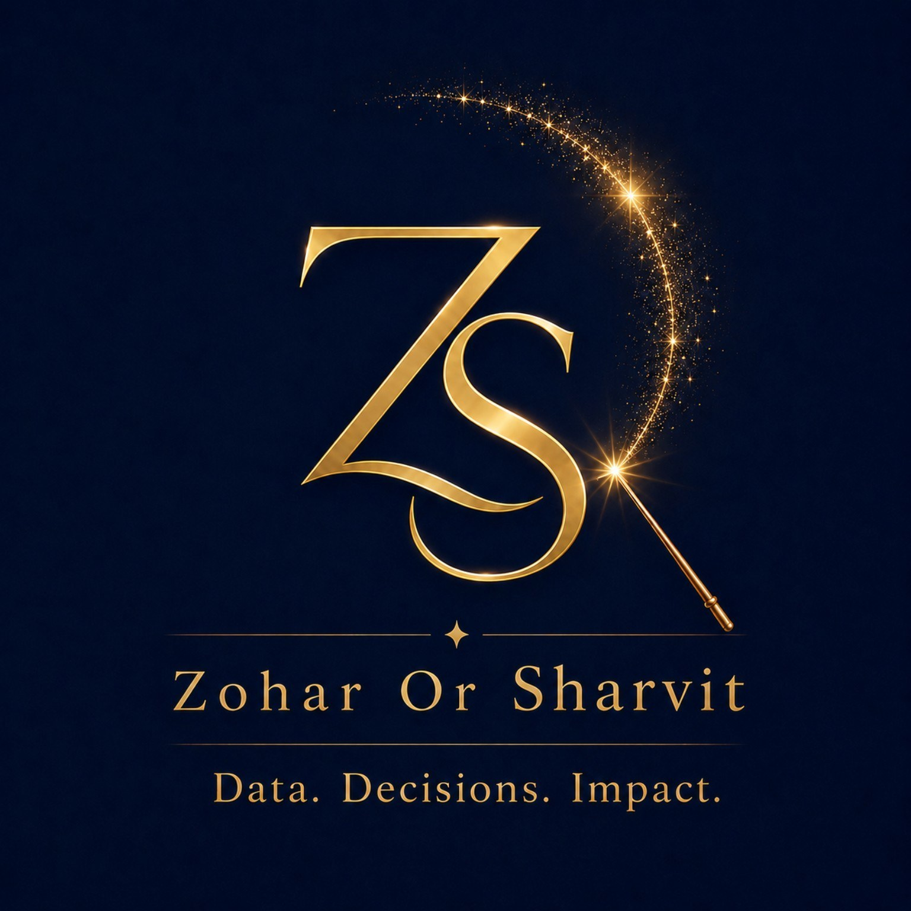

# Zohar Or Sharvit · זהר אור שרביט

**AI Lead & Applied Data Scientist, Myers-JDC-Brookdale Institute (MJB)**
Children, Youth & Young Adults team · Training as an AI Engineer & Architect, Bar-Ilan University

📍 Israel

---

I'm an applied data scientist and social researcher at the **Myers-JDC-Brookdale Institute (MJB)**, Israel's leading center for applied social research. I'm driven by how **data, measurement, and applied research** can strengthen policy: turning complex realities into evidence that helps decision makers act more precisely, allocate resources smarter, and improve the lives of children and families in Israel.

I'm a certified **Social Worker** and **Early Childhood Specialist**. Since 2018 I've led mixed methods research on children & youth at risk, families navigating divorce and separation, poverty and food insecurity, reducing socioeconomic gaps, and the social inclusion of marginalized populations.

### 🎯 My mission
Bring **AI into applied social research**: equipping the institute's researchers with innovative methodologies, making knowledge accessible to decision makers, and improving the decisions that shape **policy and practice** for the benefit of people and communities across Israel.

### 🤖 Current projects
- **Spatial decision support system** for the National Program 360 (children & youth at risk)
- **Big data analytics across a decade of National Program 360 data**, powering a BI for the national early childhood yearbook, a BI of 360 indicators, and hidden dropout analysis of youth at risk in Israel
- **ML models for early identification** of children and youth at risk
- **DL detection of depression from voice**, a decision support system for family physicians
- **A multimodal agent** that flags risk indicators for youth *(current project)*

### 🧰 Toolbox
Python · pandas · scikit-learn · Streamlit · SPSS · ML / DL · Prompt engineering · RAG · Agentic AI

### 📫 Let's connect
If you work on applied research, measurement, impact evaluation, predictive modeling in social systems, or building tools that turn data into better outcomes for children and families, I'd love to connect.

- 🔗 [LinkedIn](https://www.linkedin.com/in/zohar-or-sharvit/)
- 📚 [Studies & publications (MJB)](https://brookdale.jdc.org.il/team/zohar-sharvit/)
- ✉️ zoharsh@jdc.org
